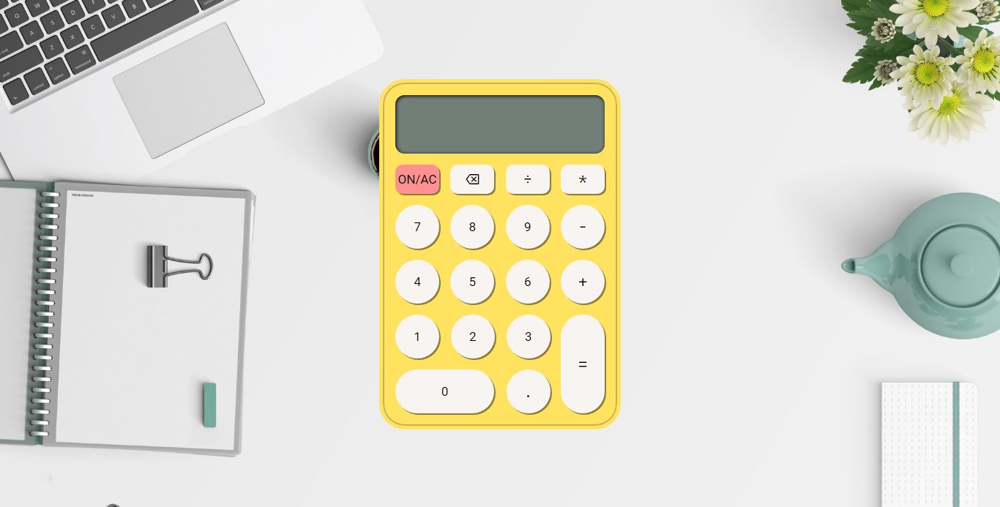

<h1 align="center">Calculadora JavaScript</h1>

Uma calculadora simples, mas que faz uso de todos operadores aritméticos mais utilizados, simulando em conjunto a interação com os botões, tanto pelo click, quanto pelo teclado.

## 🔎| Visualize
Visualize o resultado atual do projeto:

- [GitHub Pages](https://wesley-nilton.github.io/calculadora-javascript/)

## 🛸| Tecnologias
Na construção do projeto foram utilizadas as seguintes tecnologias:

- [HTML](https://developer.mozilla.org/pt-BR/docs/Web/HTML)
- [CSS](https://developer.mozilla.org/pt-BR/docs/Web/CSS)
- [JavaScript](https://developer.mozilla.org/pt-BR/docs/Web/JavaScript)

## 🎯| Bibliotecas
Na construção do projeto foram utilizadas as seguintes bibliotecas:

- [Google Fonts](https://fonts.google.com/)
- [CDNFonts](https://www.cdnfonts.com/)
- [Pexels](https://www.pexels.com/pt-br/)

## 👥| Autor(es)
Autores e contribuidores do projeto:

- [Wesley Nilton](https://github.com/Wesley-Nilton)